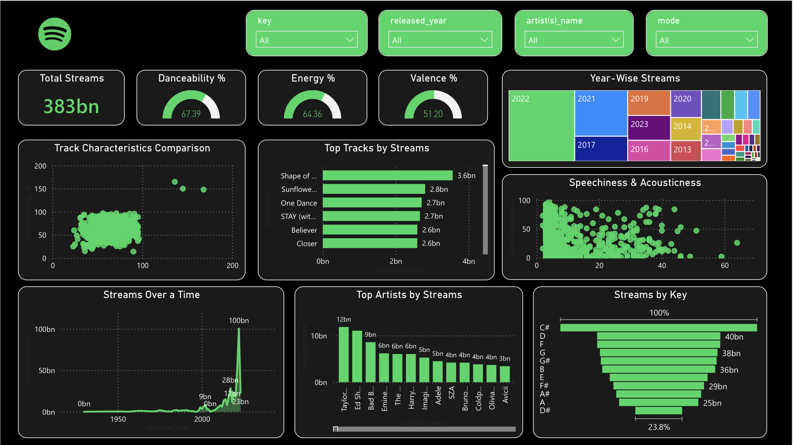

# Spotify-Dashboard
It is a listeners analysis of Spotify built on PowerBi
# Spotify Global Streaming & Track Characteristics Dashboard

An interactive, dark-themed Power BI business intelligence dashboard built to analyze global streaming trends and decode the underlying audio characteristics that drive track popularity. 

Developed as part of my business analytics focus with the **Analytics and Consulting Club, NIT Rourkela**, this project bridges the gap between raw music streaming numbers and actionable media insights.

👉 **[🔗 Click Here to Interact with the Live Dashboard!](https://ps-jarh.github.io/Spotify-Dashboard/)**  
*(Interact with live filters, track characteristics, and streaming metrics directly in your browser)*

---

## 📊 Core Features & Analytical Focus

*   **Audio Attribute Correlation:** Analyzed the interplay between sonic characteristics—**Danceability, Energy, and Valence (positivity)**—against total stream counts to determine what acoustic profiles dominate global charts.
*   **Temporal Trend Analysis:** Mapped historical streaming volumes over time to visualize listening spikes, platform growth curves, and the lifespans of top-performing tracks.
*   **Acoustic Distributions:** Visualized year-wise streams while plotting the distribution of **Speechiness vs. Acousticness** to track shifting consumer musical preferences over generations.
*   **Executive Dark UI/UX Canvas:** Built on a custom, modern dark theme designed to minimize cognitive load, create visual harmony appropriate for the Spotify brand, and elevate data readability.

---

## 🛠️ Data Architecture & Tech Stack

*   **Platform:** Power BI Desktop / Power BI Service (Web Deployment)
*   **Data Modeling:** Formulated a clean semantic model, optimizing relationships between track metadata, chronological time structures, and global streaming dimensions.
*   **ETL Pipeline (Power Query):** Structured, scrubbed, and transformed raw transactional music data, aligning variable scales (like track acoustic percentages) into standardized metrics for accurate reporting.

---

## 🧠 Project Reflection

Stepping out of traditional first-year engineering coursework to tackle Power BI was an incredibly rewarding learning curve. This project reinforced how vital semantic modeling and proper data structures are before a single visual is drawn. Navigating DAX concepts and UI design forced me to look at data not just as raw rows, but as a dynamic narrative waiting to be engineered.

A big thank you to the **Analytics and Consulting Club, NIT Rourkela** for setting up the analytical framework and providing the push to master industry-standard BI tools early.

---

## 📂 How to Explore the Repository

1.  **Interact Online:** Click the live link at the top of this file to experience the fully responsive dashboard via GitHub Pages.
2.  **Run Locally:** Download the `.pbix` file from this repository and open it using **Power BI Desktop**.
